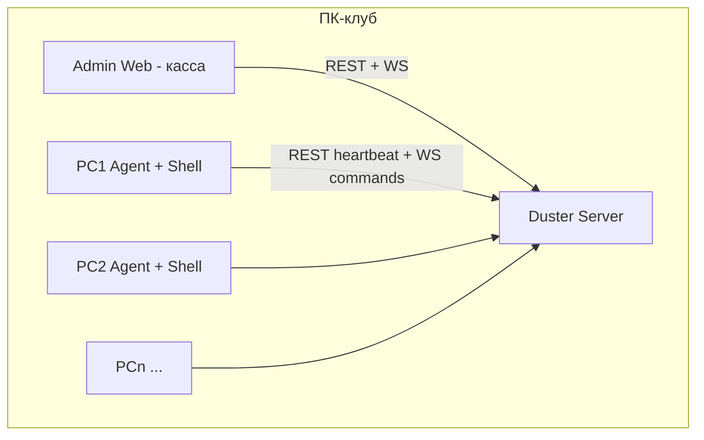

# Архитектура Duster

## Общая схема

## Роли

### Сервер (без UI)

- Хранит: админов, игроков, компьютеры, товары, пакеты, продажи, сессии.
- Раздаёт JWT: админам, агентам.
- WebSocket `/ws`: агенты получают команды (`lock`, `unlock`, `shutdown`, …), админка - push обновлений статуса ПК.
- **Wake-on-LAN**: UDP magic packet на MAC станции (порт 9).

### Админ (главный ПК)

- POS: продажа товаров и пакетов, привязка к игроку.
- Управление: блок/разблок, выключение, WoL, сессии.
- Создание игроков с группами: `standard`, `vip`, `staff`, `guest`.

### Клиент станции - два режима

| Режим | Когда использовать |
|-------|-------------------|
| **native** | Полный контроль Windows: служба + блокировка рабочего стола, shutdown, GPO/kiosk |
| **web** | Браузер в киоске (Edge `--kiosk`) на `client-web`; агент всё равно нужен для питания и lock |

На одном ПК обычно: **служба Duster.Agent** + **оболочка** (WPF/веб).

## Сессия игрока

1. Кассир продаёт пакет / пополняет баланс → `Sale`.
2. Старт сессии: `POST /api/admin/sessions/start` → сервер шлёт агенту `unlock`.
3. Конец: `sessions/:id/end` → `lock`, статус ПК `locked`.

## Безопасность (рекомендации для продакшена)

- Смените `DUSTER_JWT_SECRET` и пароль админа.
- Сервер только в локальной сети клуба или VPN.
- Отдельная VLAN для игровых ПК.
- Токен агента - как пароль; не светить в открытых логах.

## Реализовано в v0.2

- **Пополнения:** уровни бонусов (`TopupBonusTier`), персональный %, транзакции `BalanceTransaction`.
- **Профили:** email, телефон, безлимит, prepaid-минуты, история.
- **Смены:** open/close, snapshot JSON, PDF (`pdfkit`), экспорт `.dshift`.
- **Станция:** `POST /api/station/login` (PIN / пароль).
- **Экран:** команда `screenshot` → кэш в hub → админка.
- **Оболочки:** `client-web` (киоск) и `client-shell` (WPF).

## Расширения (дорожная карта)

- Потоковое видео экрана (WebRTC / RDP gateway).
- Деплой игр с файлового сервера.
- Diskless (iSCSI) - отдельный гайд по PXE.
- Смены кассиров, отчёты, интеграция эквайринга.
